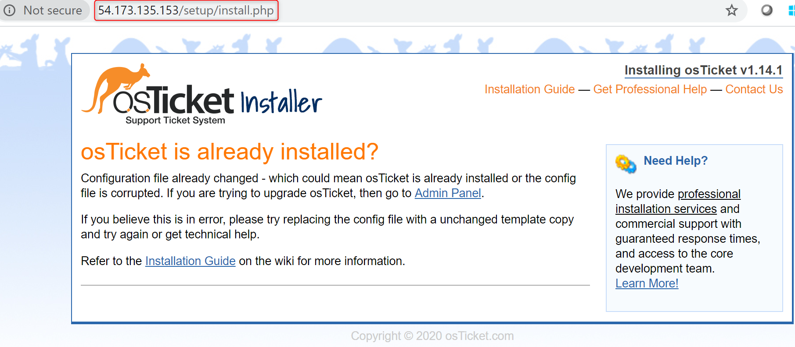
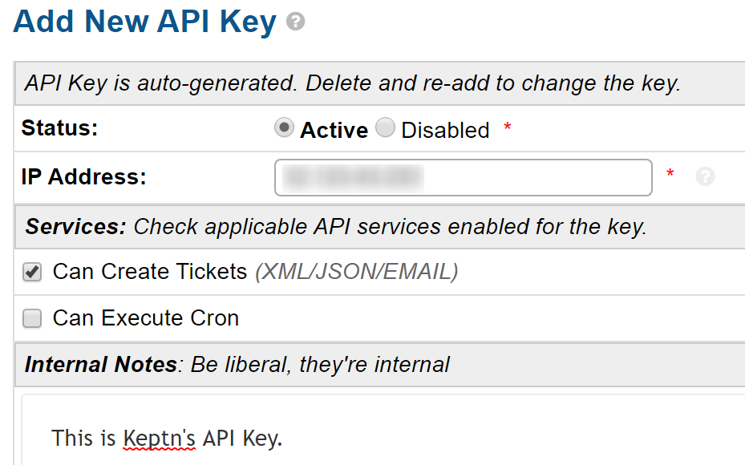
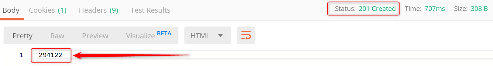
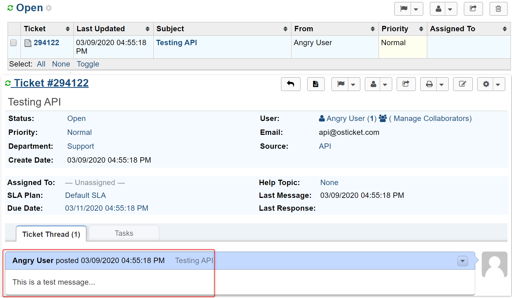

# Keptn OS Ticket Service

## Create OSTicket Machine

* Create a `t3.small Ubuntu Server 18.04` EC2 instance. Allow SSH and HTTP traffic.
* SSH into the instance (username is `ubuntu`) and execute:
```
cd ~
wget https://raw.githubusercontent.com/Dynatrace-Adam-Gardner/keptn-osticket-service/master/osTicketSetup.sh
chmod +x osTicketSetup.sh
./osTicketSetup.sh
````

## Install via Browser
Go to http://MACHINEIP/setup and follow the browser instructions.

> Note: You might get a 500 error after install. That's OK. Just refresh the page.

Make up the usernames and passwords. The database details are:
```
Database Name: osticket
Database User: osticket
Database Password: password
```



## Cleanup Install
For security, we need to cleanup and reset some files. Do that now:
```
sudo rm -rf /var/www/html/setup
sudo chmod 0644 /var/www/html/include/ost-config.php
```

## Create API Keys
Create an API key for your local machine.
* Go to http://MACHINEIP/scp/apikeys.php?a=add
* Give the key permission the `Can Create Tickets` permission.



## Validate The osTicket API
Use POSTman to send a `POST` request to `http://MACHINEIP/api/tickets.json`
* Set a header of `X-Api-Key` with the value of your API key.
* You should receive a `201 Created` response code & the ticket ID as a response.
* The `body` content should be as follows:
```
{
    "source": "API",
    "name": "Angry User",
    "email": "api@osticket.com",
    "phone": "1234567890",
    "subject": "Testing API",
    "ip": "123.211.233.122",
    "message": "This is a test message..."
}
```



Click `Agent Panel` or go to `http://MACHINEIP/scp/index.php`

You will see your ticket:


