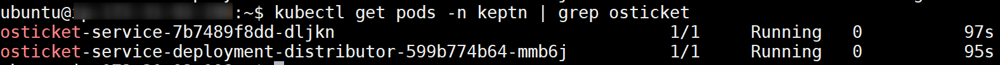

# Keptn OS Ticket Service

## Create OSTicket Machine

* Create a `t3.small Ubuntu Server 18.04` EC2 instance with 10GB disk space. Allow SSH and HTTP traffic.
* SSH into the instance (username is `ubuntu`) and execute:
```
cd ~
wget https://raw.githubusercontent.com/Dynatrace-Adam-Gardner/keptn-osticket-service/master/osTicketSetup.sh
chmod +x osTicketSetup.sh
./osTicketSetup.sh
````

## Continue via Browser
Go to http://MACHINEIP/setup and follow the browser instructions.

> Note: You might get a 500 error after install. That's OK. Just refresh the page.

Make up the usernames and passwords. The database details are:
```
Database Name: osticket
Database User: osticket
Database Password: password
```


## Cleanup Install
For security, we need to cleanup and reset some files. Do that now:
```
sudo rm -rf /var/www/html/setup
sudo chmod 0644 /var/www/html/include/ost-config.php
```

## Create API Keys
Create an API key for the Keptn IP address.
* Go to http://MACHINEIP/scp/apikeys.php?a=add
* Give the key permission the `Can Create Tickets` permission.


Make a note of this API key.

## Deploy the osTicket Service

**On the Keptn VM,** run the following:
```
cd ~
wget https://raw.githubusercontent.com/Dynatrace-Adam-Gardner/keptn-osticket-demo/master/osticket-service-deployment.yaml
wget https://raw.githubusercontent.com/Dynatrace-Adam-Gardner/keptn-osticket-demo/master/osticket-distributor.yaml
```

Edit lines `25` and `27` of the `osticket-service-deployment.yaml` to reflect your details.
The URL should be the IP address of your **osticket** machine and the API key you generated above.

Save and apply both files:
```
kubectl apply -f osticket-service-deployment.yaml
kubectl apply -f osticket-distributor.yaml
```

Validate that you have two pods running:
```
kubectl get pods -n keptn | grep osticket
```



## Run an Evaluation

**On the Keptn VM,** ask `keptn` to start an evaluation:

```
keptn send event start-evaluation --project=website --stage=quality --service=front-end --timeframe=2m
```
This command will return a `keptn context` ID. Make a note of this.

Now wait for a ticket in osTicket... You can check whether the evaluation is done in keptn:

```
keptn get event evaluation-done --keptn-context=*****
```

---

# Troubleshooting
This section is optional and only to be used for troubleshooting.

## Optional : Manually Validate The osTicket API
If the Keptn integration doesn't work, first try firing a `POST` request into `osticket` manually.

You'll need to generate a new API key and give it **YOUR** IP address.

Use POSTman to send a `POST` request to `http://MACHINEIP/api/tickets.json`
* Set a header of `X-Api-Key` with the value of your API key.
* You should receive a `201 Created` response code & the ticket ID as a response.
* The `body` content should be as follows:
```
{
    "source": "API",
    "name": "Angry User",
    "email": "api@osticket.com",
    "phone": "1234567890",
    "subject": "Testing API",
    "ip": "123.211.233.122",
    "message": "This is a test message..."
}
```


Click `Agent Panel` or go to `http://MACHINEIP/scp/index.php`

You will see your ticket:


